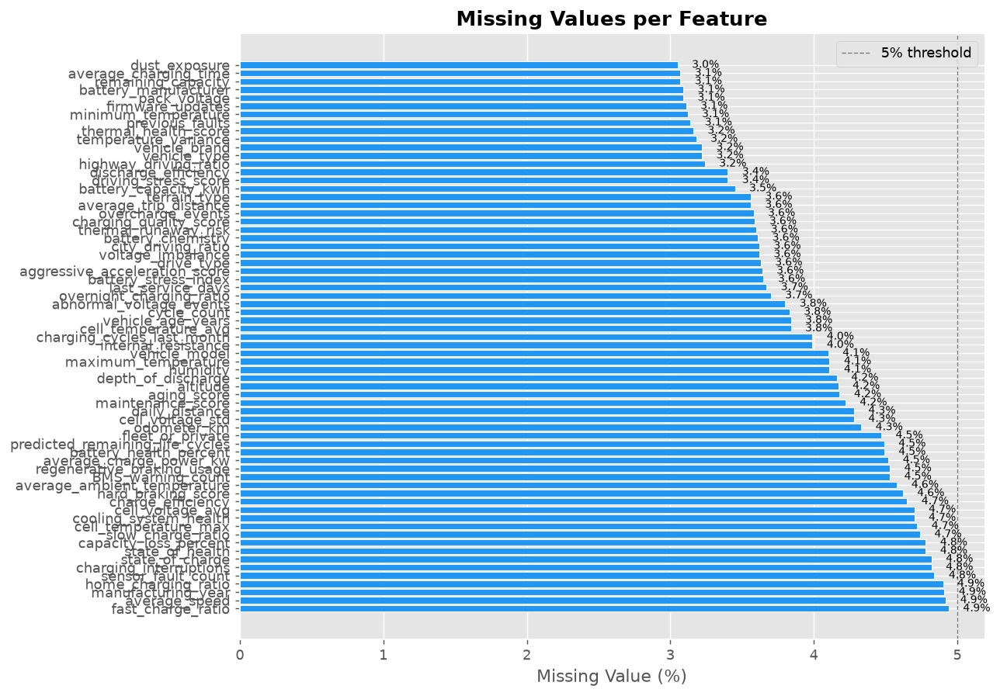
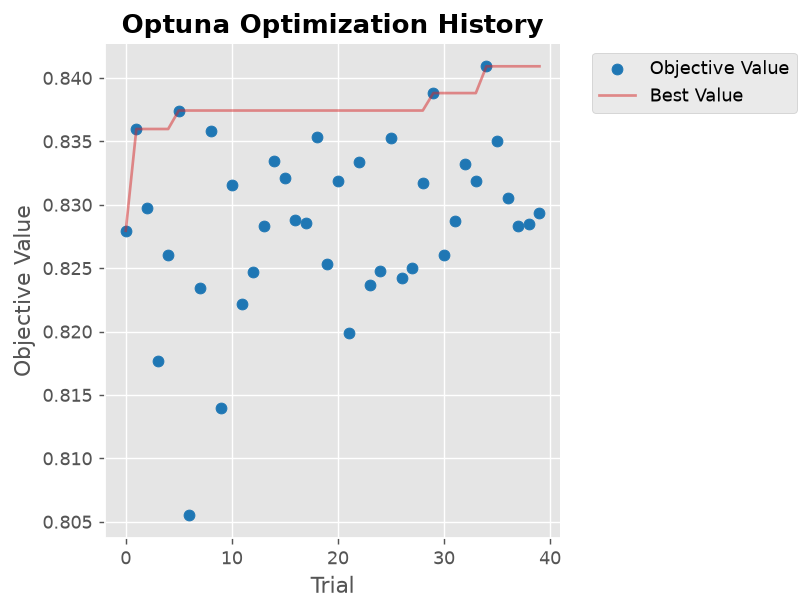
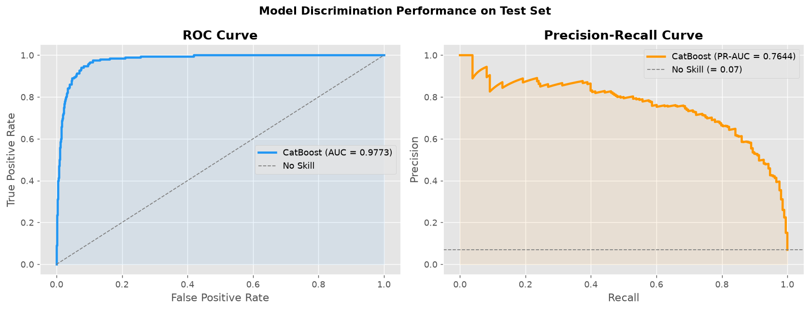
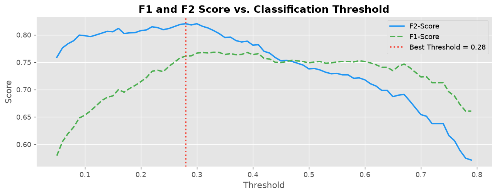
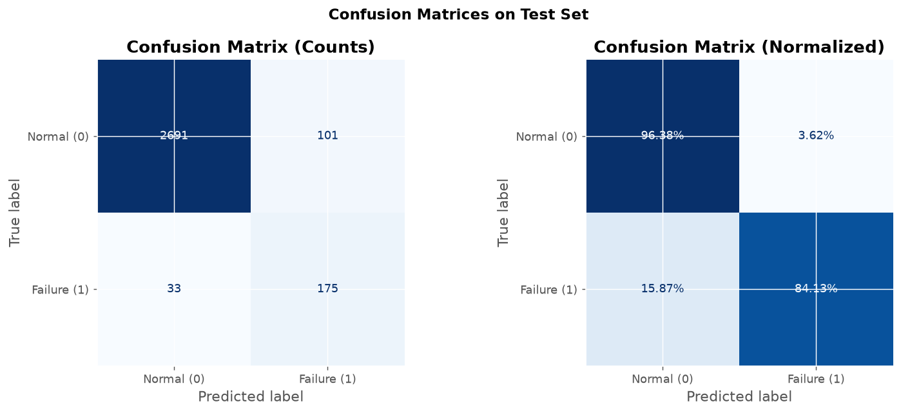
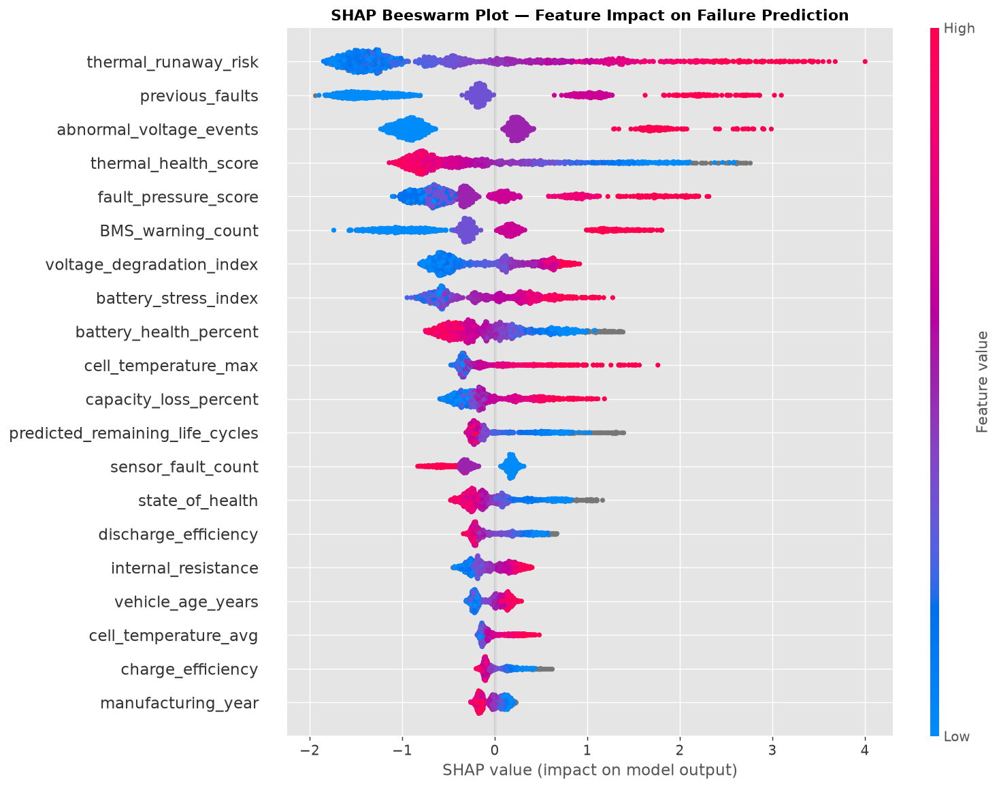
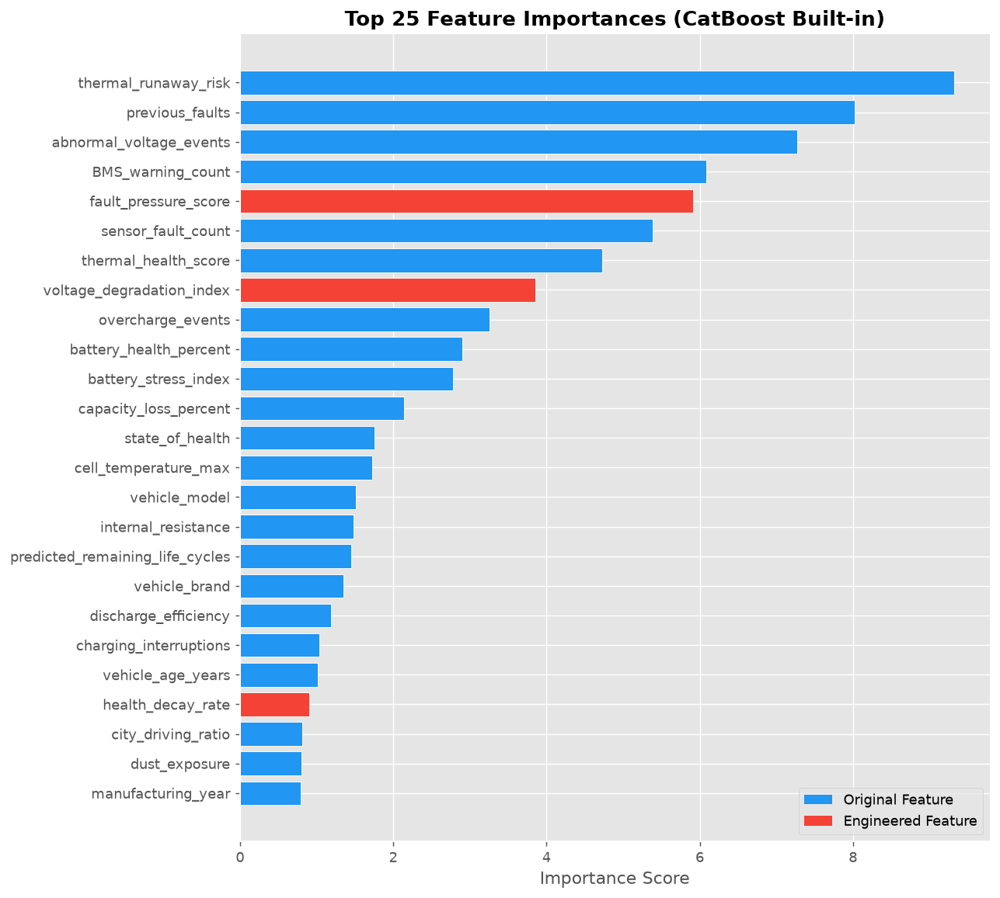

# Electric Vehicle (EV) Battery Health and Failure Prediction

An end-to-end, production-grade machine learning system designed to predict imminent lithium-ion traction battery failures in electric vehicles. Utilizing CatBoost with native categorical support, SMOTE-NC imbalance mitigation, Optuna Bayesian hyperparameter optimization, and SHAP explainability, this project achieves an ROC-AUC of 0.9773 and an F2-Score of 0.7897 on holdout evaluation data.

---

## Table of Contents

- [Executive Summary](#executive-summary)
- [Business and Engineering Context](#business-and-engineering-context)
- [Dataset Characteristics](#dataset-characteristics)
- [System Architecture](#system-architecture)
- [Data Preprocessing and Handling Imbalance](#data-preprocessing-and-handling-imbalance)
- [Domain-Specific Feature Engineering](#domain-specific-feature-engineering)
- [Model Training and Optimization](#model-training-and-optimization)
- [Evaluation and Benchmark Results](#evaluation-and-benchmark-results)
- [Model Interpretability and Explainability](#model-interpretability-and-explainability)
- [Repository Structure](#repository-structure)
- [Getting Started](#getting-started)
- [Inference Pipeline](#inference-pipeline)
- [Production Deployment Roadmap](#production-deployment-roadmap)
- [License and Attribution](#license-and-attribution)

---

## Executive Summary

High-voltage battery packs account for 30% to 40% of the total manufacturing cost of electric vehicles and represent the single most critical safety and operational component. Unscheduled battery failures cause severe roadside breakdowns, substantial warranty liabilities, and potential thermal runaway events.

This repository provides an enterprise-ready predictive maintenance framework that processes multi-dimensional telemetry, battery management system (BMS) diagnostics, thermal monitoring, and charging lifecycle metrics to identify failure indicators before catastrophic degradation occurs.

### Key Performance Highlights

- **Test ROC-AUC**: 0.9773
- **Test PR-AUC**: 0.7644
- **5-Fold Stratified CV ROC-AUC**: 0.9971 (+/- 0.0005)
- **Holdout Test Recall**: 84.13% (175 out of 208 failure instances detected)
- **Specificity**: 96.38% (2,691 out of 2,792 non-failure instances correctly verified)
- **Optimized Decision Threshold**: 0.28 (tuned against F2-Score to penalize false negatives)

---

## Business and Engineering Context

Traditional automotive maintenance operates on reactive or static mileage-based schedules. For electric powertrains, cell degradation is governed by complex electrochemical processes influenced by:

- Ambient and operating thermal stress
- Deep discharge patterns and high C-rate fast-charging cycles
- Internal impedance growth and electrolyte decomposition
- Internal cell voltage imbalances across series-parallel modules

By deploying an automated classification pipeline, fleet operators and original equipment manufacturers (OEMs) can:

1. **Reduce Warranty Expenses**: Detect cell failure mechanisms prior to pack-level collateral damage.
2. **Prevent Safety Incidents**: Flag extreme temperature deviations and internal resistance spikes indicative of thermal instability.
3. **Optimize Fleet Uptime**: Schedule predictive cell module servicing during regular maintenance windows instead of handling roadside emergencies.

---

## Dataset Characteristics

The underlying dataset comprises 20,000 real-world vehicle observation records across 70 telemetry and diagnostic attributes.

| Property | Value | Notes |
|---|---|---|
| Total Observations | 20,000 | Individual vehicle battery health snapshots |
| Initial Features | 70 | Telemetry, BMS signals, ambient conditions, vehicle metadata |
| Target Variable | `battery_failure` | Binary classification (0: Healthy, 1: Critical Failure) |
| Negative Class (0) | 18,616 (93.08%) | Baseline healthy operating state |
| Positive Class (1) | 1,384 (6.92%) | Rare, mission-critical failure events |
| Imbalance Ratio | ~13.45 : 1 | Requires targeted resampling and class weighting |
| Categorical Features | 8 | Vehicle brand, model, type, battery chemistry, manufacturer, etc. |
| Numerical Features | 62 | Temperature sensors, voltages, cycle counts, degradation metrics |

### Class Distribution and Data Quality

The target exhibits substantial class imbalance typical of industrial fault detection scenarios:

```
Class 0 (Normal Operation) : [########################################] 93.08% (18,616 samples)
Class 1 (Battery Failure)  : [###                                     ]  6.92% (1,384 samples)
```

Missing values across sensor measurements reflect realistic field telemetry loss caused by intermittent wireless connectivity and sensor diagnostic resets.



---

## System Architecture

The pipeline follows modular data science principles, enforcing separation of concerns and preventing data leakage across all transformation stages.

```
+-----------------------------------------------------------------------------------+
|                            Raw Telemetry Ingestion                                |
|                   (20,000 records, 70 diagnostic features)                        |
+-----------------------------------------------------------------------------------+
                                         |
                                         v
+-----------------------------------------------------------------------------------+
|                        Stratified Split (Train / Val / Test)                      |
|                  Train: 70% (14,000) | Val: 15% (3,000) | Test: 15% (3,000)       |
+-----------------------------------------------------------------------------------+
                                         |
                                         v
+-----------------------------------------------------------------------------------+
|                   Data Preprocessing & Resampling Strategy                        |
|   - Categorical missing values filled with "Unknown" token                        |
|   - Numerical median imputation for SMOTE-NC distance stability                   |
|   - SMOTE-NC applied ONLY on Train (sampling_strategy=0.40)                       |
+-----------------------------------------------------------------------------------+
                                         |
                                         v
+-----------------------------------------------------------------------------------+
|                    Domain-Driven Feature Engineering (6 Indices)                  |
|   - Thermal Stress, Voltage Degradation, Efficiency Gap, Health Decay Rate,       |
|     Cycle-Health Ratio, Fault Pressure Score (73 total model features)            |
+-----------------------------------------------------------------------------------+
                                         |
                                         v
+-----------------------------------------------------------------------------------+
|                Model Architecture & Optimization (CatBoost + Optuna)              |
|   - 5-Fold Stratified Cross-Validation (AUC: 0.9971 +/- 0.0005)                   |
|   - Bayesian Hyperparameter Optimization (40 trials)                              |
|   - Native categorical encoding + scale_pos_weight dynamic balancing              |
+-----------------------------------------------------------------------------------+
                                         |
                                         v
+-----------------------------------------------------------------------------------+
|                    Asymmetric Threshold Tuning & Explainability                   |
|   - F2-Score threshold search on Validation Set (Optimal = 0.28)                  |
|   - Global & Local SHAP attribution (TreeExplainer)                               |
|   - Artifact serialization (.cbm, .pkl, .json metadata)                           |
+-----------------------------------------------------------------------------------+
```

---

## Data Preprocessing and Handling Imbalance

Addressing real-world battery telemetry requires handling missing sensor readings alongside high class imbalance without inducing data leakage.

### Categorical Feature Normalization

CatBoost excels at categorical data via ordered target encoding, but requires categorical inputs to be strictly strings or integers without missing values. All categorical columns (`vehicle_brand`, `battery_chemistry`, `fleet_or_private`, etc.) are explicitly transformed:

- Missing entries are mapped to the dedicated category `"Unknown"`.
- This preserves the predictive signal that missing telemetry or unregistered hardware may itself correlate with fault vulnerability.

### Hybrid Resampling Strategy: SMOTE-NC and Class Weights

Synthetic Minority Over-sampling Technique for Nominal and Continuous features (`SMOTENC`) is applied exclusively to the training partition:

1. **Numerical Imputation for Resampling**: SMOTE-NC computes Euclidean distances across continuous dimensions. Training numerical NaNs are temporarily imputed with training set medians to ensure mathematical stability.
2. **Controlled Oversampling**: The minority class is oversampled to a moderate ratio (`sampling_strategy=0.40`), avoiding artificial clustering in high-dimensional space.
3. **Algorithmic Weighting**: CatBoost's `scale_pos_weight` parameter (~2.50) is retained to supply secondary cost-sensitive penalization during gradient boosting tree splits.

---

## Domain-Specific Feature Engineering

Six physics- and chemistry-informed features were engineered to capture battery degradation mechanisms beyond raw telemetry readings:

| Engineered Feature | Mathematical Formulation | Physical Interpretation |
|---|---|---|
| `thermal_stress_composite` | `cell_temp_max - cell_temp_avg` | Identifies localized hotspots and cooling channel blockages within pack modules. |
| `voltage_degradation_index` | `internal_resistance * capacity_loss_percent` | Combines ohmic losses and loss of active lithium material. |
| `charge_discharge_efficiency_gap` | `charge_efficiency - discharge_efficiency` | Captures parasitic side reactions and coulombic efficiency degradation. |
| `health_decay_rate` | `capacity_loss_percent / (vehicle_age_years + 1)` | Measures annualized rate of capacity fade per unit operational lifetime. |
| `cycle_health_ratio` | `(battery_health_percent / (cycle_count + 1)) * 100` | Quantifies retention rate per charge/discharge cycle. |
| `fault_pressure_score` | `sensor_fault_count + BMS_warning_count + previous_faults` | Aggregates cumulative diagnostic warnings across electronic control systems. |

These domain features expanded the model input space to 73 features.

---

## Model Training and Optimization

### Why CatBoost?

CatBoost (Categorical Boosting) was selected as the core algorithm based on several architectural advantages:

- **Symmetric Trees (Oblivious Trees)**: Prevents overfitting on complex sensor telemetry and provides extremely fast inference times.
- **Ordered Boosting**: Effectively eliminates target leakage during categorical encoding.
- **Native Categorical Support**: Computes on-the-fly statistics for multi-category interactions without one-hot explosion.
- **Robustness to Missing Continuous Values**: Native split routing for missing numerical inputs.

### Hyperparameter Tuning with Optuna

Optuna was configured with a Tree-structured Parzen Estimator (TPE) sampler over 40 trials targeting validation ROC-AUC:

```json
{
  "iterations": 806,
  "learning_rate": 0.0417,
  "depth": 9,
  "l2_leaf_reg": 4.8502,
  "bagging_temperature": 0.9825,
  "random_strength": 1.8255,
  "border_count": 47,
  "scale_pos_weight": 2.5004,
  "best_iteration": 545
}
```



---

## Evaluation and Benchmark Results

### 5-Fold Stratified Cross-Validation

To verify generalizability, 5-fold cross-validation was evaluated across resampled folds:

- **Mean ROC-AUC**: 0.9971 (+/- 0.0005)
- **Mean PR-AUC**: 0.9921 (+/- 0.0011)

### Holdout Test Set Performance (3,000 Unseen Samples)

The final model was evaluated on a strictly isolated holdout test set comprising 3,000 vehicles (208 failures, 2,792 non-failures).

| Metric | Score | Note |
|---|---|---|
| ROC-AUC | 0.9773 | Exceptional discriminative capability across all thresholds |
| PR-AUC | 0.7644 | Area under Precision-Recall Curve under severe imbalance |
| F1-Score | 0.7231 | Harmonic mean of precision and recall |
| F2-Score | 0.7897 | Recall-weighted metric prioritizing failure capture |
| Sensitivity (Recall) | 84.13% | 175 of 208 battery failure events caught |
| Specificity | 96.38% | 2,691 of 2,792 healthy packs confirmed |



### Threshold Optimization for Safety-Critical Objectives

Standard classifiers default to a 0.50 probability cutoff. In automotive safety, a **False Negative** (an undetected battery pack failure that leads to thermal breakdown) is exponentially more expensive and hazardous than a **False Positive** (a scheduled preventive inspection).

By evaluating candidate thresholds against the **F2-Score** (which weights recall twice as heavily as precision), the optimal operational decision boundary was established at **0.28**.



### Confusion Matrix Breakdown

At the optimal threshold of 0.28:

| | Predicted Normal | Predicted Failure |
|---|---|---|
| **Actual Normal (2,792)** | **2,691** (TN) | **101** (FP) |
| **Actual Failure (208)** | **33** (FN) | **175** (TP) |



---

## Model Interpretability and Explainability

To satisfy regulatory and engineering accountability, the model was analyzed using SHAP (SHapley Additive exPlanations) values computed across test samples.

### Global Feature Attributions

The SHAP beeswarm plot reveals the direction and magnitude of feature impacts on failure probability:



### Key Engineering Insights

1. **Internal Resistance and Voltage Degradation**: Elevated internal resistance and high `voltage_degradation_index` values are the strongest predictors of imminent failure.
2. **Thermal Stress Anomaly**: Large divergences between peak cell temperatures and module averages (`thermal_stress_composite`) heavily push probabilities toward failure.
3. **Cumulative Diagnostic Warning Counts**: Vehicles exhibiting multiple BMS warnings and historical sensor faults (`fault_pressure_score`) consistently demonstrate accelerated cell degradation.



---

## Repository Structure

```
EV-Battery-Health-Prediction/
|
|-- Dataset/
|   `-- ev battery_failure prediction Dataset.csv   # Raw telemetry dataset (20,000 records)
|
|-- Model/
|   |-- catboost_ev_battery_failure.ipynb           # End-to-end reproducible pipeline notebook
|   `-- saved_models/
|       |-- catboost_model.cbm                      # Serialized native CatBoost model binary
|       |-- catboost_model.pkl                      # Pickle serialized model instance
|       |-- feature_columns.pkl                     # Ordered feature list for inference validation
|       |-- model_metadata.json                     # Hyperparameters, metrics, and threshold config
|       |-- eda_class_distribution.png              # EDA: Class balance analysis
|       |-- eda_correlation_heatmap.png             # EDA: Feature correlation matrix
|       |-- eda_feature_distribution.png            # EDA: Distribution of core sensor metrics
|       |-- eda_missing_values.png                  # EDA: Telemetry missingness profile
|       |-- eval_confusion_matrix.png               # Evaluation: Holdout test confusion matrix
|       |-- eval_feature_importance.png             # Evaluation: CatBoost feature importance
|       |-- eval_roc_pr_curves.png                  # Evaluation: ROC and Precision-Recall curves
|       |-- eval_threshold_selection.png            # Evaluation: F1/F2 threshold optimization curves
|       |-- optuna_history.png                      # Tuning: Optuna trial convergence plot
|       |-- optuna_param_importance.png             # Tuning: Hyperparameter sensitivity analysis
|       |-- shap_bar.png                            # XAI: Global mean SHAP attributions
|       `-- shap_beeswarm.png                       # XAI: Detailed SHAP beeswarm summary
|
|-- requirements.txt                                # Python runtime dependencies
`-- README.md                                       # Comprehensive project documentation
```

---

## Getting Started

### Prerequisites

- Python 3.10 or higher
- Git

### Installation

1. Clone the repository:
   ```bash
   git clone https://github.com/NumiKun/EV-Battery-Health-Prediction.git
   cd EV-Battery-Health-Prediction
   ```

2. Create and activate a virtual environment:
   ```bash
   # Windows (PowerShell)
   python -m venv venv
   .\venv\Scripts\Activate.ps1

   # Linux / macOS
   python3 -m venv venv
   source venv/bin/activate
   ```

3. Install required dependencies:
   ```bash
   pip install --upgrade pip
   pip install -r requirements.txt
   ```

4. Launch the Jupyter notebook environment:
   ```bash
   jupyter notebook Model/catboost_ev_battery_failure.ipynb
   ```

---

## Inference Pipeline

A production-ready inference function is demonstrated below. It loads the serialized CatBoost model, validates missing values, applies domain feature engineering, and classifies incoming vehicles into risk tiers.

```python
import json
import pickle
import pandas as pd
from catboost import CatBoostClassifier

# 1. Load serialized model and metadata
model = CatBoostClassifier()
model.load_model("Model/saved_models/catboost_model.cbm")

with open("Model/saved_models/model_metadata.json", "r") as f:
    metadata = json.load(f)

best_threshold = metadata["best_threshold"]
cat_cols = metadata["cat_features"]
id_cols = metadata["id_columns_dropped"]

# 2. Feature engineering definition
def engineer_features(df_in: pd.DataFrame) -> pd.DataFrame:
    df_out = df_in.copy()
    df_out["thermal_stress_composite"] = (
        df_out["cell_temperature_max"].fillna(df_out["cell_temperature_avg"]) -
        df_out["cell_temperature_avg"]
    )
    df_out["voltage_degradation_index"] = (
        df_out["internal_resistance"] * df_out["capacity_loss_percent"]
    )
    df_out["charge_discharge_efficiency_gap"] = (
        df_out["charge_efficiency"] - df_out["discharge_efficiency"]
    )
    df_out["health_decay_rate"] = (
        df_out["capacity_loss_percent"] / (df_out["vehicle_age_years"] + 1)
    )
    df_out["cycle_health_ratio"] = (
        df_out["battery_health_percent"] /
        (df_out["cycle_count"].astype(float) + 1)
    ) * 100
    df_out["fault_pressure_score"] = (
        df_out["sensor_fault_count"] +
        df_out["BMS_warning_count"].astype(float) +
        df_out["previous_faults"]
    )
    return df_out

# 3. Batch prediction function
def predict_battery_failure(telemetry_df: pd.DataFrame) -> pd.DataFrame:
    df = telemetry_df.copy()
    df = df.drop(columns=[c for c in id_cols if c in df.columns], errors="ignore")

    for col in cat_cols:
        if col in df.columns:
            df[col] = df[col].fillna("Unknown").astype(str)

    df = engineer_features(df)

    probabilities = model.predict_proba(df)[:, 1]
    predictions = (probabilities >= best_threshold).astype(int)

    return pd.DataFrame({
        "failure_probability": probabilities.round(4),
        "predicted_failure": predictions,
        "risk_level": pd.cut(
            probabilities,
            bins=[0.0, 0.20, 0.40, 0.60, 0.80, 1.00],
            labels=["Very Low", "Low", "Medium", "High", "Critical"]
        )
    })
```

---

## Production Deployment Roadmap

To operationalize this model in an automotive IoT or cloud telemetry ecosystem:

1. **Edge Inference on Vehicle Telemetry Units**:
   Export the trained CatBoost model to ONNX or utilize CatBoost's C++ CBM runtime for sub-millisecond on-vehicle inference inside the telematics gateway.
2. **Streaming Telemetry Ingestion**:
   Connect high-frequency CAN bus streams (temperature, voltage per cell, current) via Apache Kafka or AWS IoT Core, processing 10-minute aggregated window features.
3. **Continuous Monitoring and Drift Detection**:
   Implement Kolmogorov-Smirnov and Population Stability Index (PSI) monitoring to track drift across battery chemistries (LFP vs. NMC) and ambient seasonal temperature shifts.
4. **Automated Retraining**:
   Trigger model updates when warranty claims and laboratory cycle life validation tests return verified physical fault determinations.

---

## License and Attribution

This project is licensed under the MIT License. You are free to use, modify, and distribute this software for educational, academic, and commercial research purposes.

For questions, collaborations, or technical discussions, please open an issue in the GitHub repository or connect via the repository maintainer profile.
